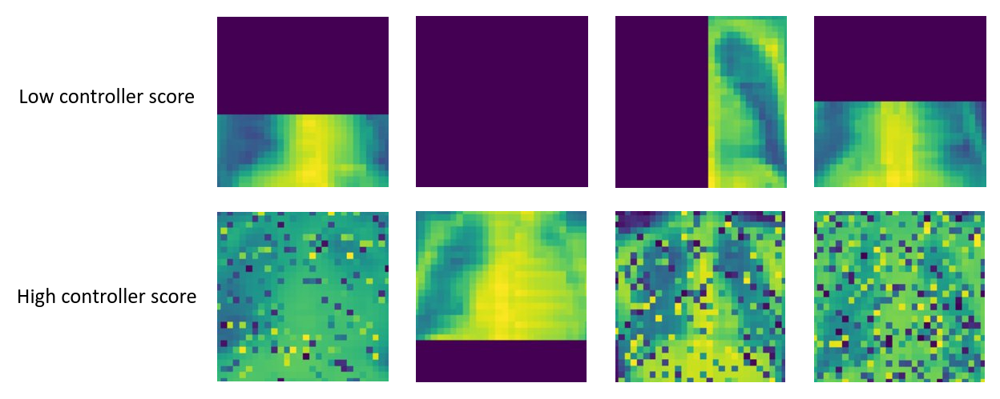
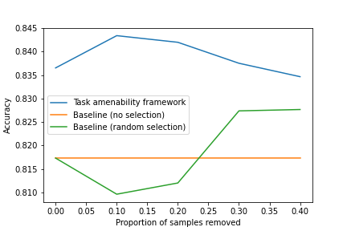

# Image quality assessment for machine learning tasks using meta-reinforcement learning

_This repository presents the code and the public dataset experiments, described in the following submitted work._

Authors: Shaheer U. Saeed [1], Yunguan Fu [1, 2], Vasilis Stavrinides [3, 4], Zachary M. C. Baum [1], Qianye Yang [1], Mirabela Rusu [5], Richard E. Fan [6], Geoffrey A. Sonn [5, 6], J. Alison Noble [7], Dean C. Barratt [1], Yipeng Hu [1, 7].

Affiliations:  
[1] Centre for Medical Image Computing,  
    Wellcome/EPSRC Centre for Interventional \& Surgical Sciences, and  
    Department of Medical Physics \& Biomedical Engineering,  
    University College London, London, UK.  
[2] InstaDeep, London, UK.  
[3] Division of Surgery \& Interventional Science, University College London, London, UK.  
[4] Department of Urology, University College Hospital NHS Foundation Trust, London, UK.  
[5] Department of Radiology, Stanford University, Stanford, California, USA.  
[6] Department of Urology, Stanford University, Stanford, California, USA.  
[7] Department of Engineering Science, University of Oxford, Oxford, UK.

### Previous works

1) [Saeed, S.U., Fu, Y., Baum, Z.M., Yang, Q., Rusu, M., Fan, R.E., Sonn, G.A., Barratt, D.C. and Hu, Y., 2021, June. Learning image quality assessment by reinforcing task amenable data selection. In International Conference on Information Processing in Medical Imaging (pp. 755-766). Springer, Cham.](https://link.springer.com/chapter/10.1007/978-3-030-78191-0_58)  
2) [Saeed, S.U., Fu, Y., Stavrinides, V., Baum, Z., Yang, Q., Rusu, M., Fan, R.E., Sonn, G.A., Noble, J.A., Barratt, D.C. and Hu, Y., 2021. Adaptable image quality assessment using meta-reinforcement learning of task amenability. arXiv preprint arXiv:2108.04359.](https://arxiv.org/abs/2108.04359)

## Image quality assessment using task amenable data selection

Image quality assessment (IQA) is useful in medicine and beyond as it helps to ensure that a target task intended for an image can be performed reliably. Current IQA approaches used in clinical practice often rely on human interpretation of both the criteria for assessment and the image being assessed. Recent automated methods provide repeatable measurements but often rely on human labels of IQA. Furthermore, the extent to which these methods indicate the impact on clinical task performance is still an open question. We argue that an objective, task-specific, image quality measure is useful as an increasing number of clinical tasks are being automated. This automation of downstream tasks may result in an unknown subjective task-specific IQA as the impact of an image on downstream task performance may be significantly different from human intuition. In our previous work, we introduced the concept of task amenability to measure this task-specific quality without any subjective labels of IQA and propose a reinforcement learning-based meta-learning framework to learn it. We refer to this task-specific quality as "task amenability". We propose to train a task predictor which performs the target task together with a controller which learns task amenability assessment. The controller selects images based on their task amenability such that selecting highly task amenable data can lead to an improvement in target task performance. The joint training using reinforcement learning-based meta-learning allows for such a measure to be learnt without the need for human labels of IQA. This measure of task-specific quality has several clinical applications such as meeting clinically defined accuracy tolerances for specific tasks by rejecting images with low task amenability, guiding re-acquisition decisions if the acquired images have a low task amenability in applications where re-acquisition is inexpensive such as free-hand ultrasound, and providing feedback to the operator which could serve as an indirect indicator for operator skill.

In this repository we provide the reinforcement learning (RL) environment which allows for task amenability to be learnt using our proposed method. We also provide two interfaces, for two RL algorithms, [deep deterministic policy gradient (DDPG)](https://arxiv.org/abs/1509.02971) and [proximal policy optimisation (PPO)](https://arxiv.org/abs/1707.06347), which allows for different datasets and target tasks to be used in the task amenability framework. Please see `example_ddpg.py` and `example_ppo.py` for examples of how custom datasets and target tasks can be used to train RL controllers to learn task amenability using the environment provided in `envs/task_amenability.py`. Note that we use classes defined in `interface.py` for these examples which provides an interface to interact with the environment. Custom architectures for the DDPG or PPO algorithms can be used by modifying `interface.py`. The examples can be run from the root directory of this repository.

This repository also contains the code for an experiment in which the [PneumoniaMNIST dataset](https://medmnist.github.io/) is used (with DDPG used to train the controller). We corrupt this dataset artificially and use the proposed task amenability framework to learn task amenability for a target task of pneumonia diagnosis. The code for the experiment is contained in `pneumoniamnist_experiment.py` and `pneumoniamnist_experiment_test_final_models.py` files. The final trained model and results along with the artificially corrupted data are contained in the directory `pneumoniamnist_experiment`. Samples of the images are presented below where a 'low controller score' means a controller predicted value below the 10th percentile and 'high controller score' means above. The second figure shows performance at different rejection ratios (ratio of samples with the lowest controller predicted values removed).





## Using your own data and target task

The interface provided in `interface.py` allows for custom image datasets and target tasks to be used within the task amenability framework. The `PPOInterface` and `DDPGInterface` allow for PPO or DDPG RL algorithms to be used for training. Either of these interfaces can be initialised with the data and the task predictor to be used for the target task. After initialising either of these provided interfaces can be used for training the RL controller and the target task predictor. Training can be done simply by calling the `train` method of the interfaces. The `example_ppo.py` and `example_ddpg.py` scripts demonstrate some of the core functionality. A simple example of how the `DDPGInterface` can be used is provided below with brief explanations (the `PPOInterface` can be used in a similar manner).

### Initialising the interface

To initialise the interface, we need the dataset and task predictor network. Therefore, the interface can be initialised by providing:
- `x_train`, `y_train`: train set samples
- `x_val`, `y_val`: validation set samples
- `x_holdout`, `y_holdout`: holdout set samples
- `task_predictor`: a `keras` or `tensorflow` model which has been compiled
- `img_shape`: shape of a single image in the dataset  

`x_{set}` are the input images and `y_{set}` are ground truth labels for the target task. The dimensions of `x_{set}` must be `samples x height x width x channels` in the case that image data is being used; `img_shape` must then be a tuple `(height, width, channels)` (non-image data may be used as input in which case `img_shape` will be the shape of the a single non-image data sample and line 42, 43, 73 and 105 may need to be modified in `envs/task_amenability.py` alongside the controller architecture, however, we have not tested our code with non-image data). The shape of `y_{set}` must be the number of samples along the first dimension and the other dimensions depend on the target task. As an example, if the labels are binary classification labels then `y_set` must have the shape `samples x 1`.

The `task_predictor` can be a simple neural network model which has inputs of the shape `img_shape` and it must perform the target task, therefore, the output shape depends on the target task. For a binary image classification task, a model can be created and compiled as follows (note that this is just an example model to demonstrate the functionality of the interface, we did not tune the architecture or any hyper-parameters for this model and we do not recommend the use of this model for any target task, please see `pneumoniamnist_experiment.py` for an example of a larger model which was used in one of our experiments):

```
from keras import layers
import keras
import numpy as np

def build_task_predictor(img_shape):
    inputs = keras.Input(shape=img_shape)
    x = layers.Conv2D(32, (3,3), activation='relu')(inputs)
    x = layers.MaxPool2D((2,2))(x)
    x = layers.Conv2D(32, (3,3), activation='relu')(x)
    x = layers.MaxPool2D((2,2))(x)
    x = layers.Flatten()(x)
    x = layers.Dense(64, activation='relu')(x)
    x = layers.Dropout(0.3)(x)
    x = layers.Dense(32, activation='relu')(x)
    outputs = layers.Dense(1, activation='sigmoid')(x)
    return keras.Model(inputs=inputs, outputs=outputs)
    
img_shape = (96, 96, 1)
task_predictor = build_task_predictor(img_shape)

task_predictor.compile(optimizer='adam', loss='binary_crossentropy', metrics=['accuracy'])
```

The last line of code in the block above specifies the loss to be used for the target task as well as the metric to be used to formulate the reward. In the code block, due to the target task being binary classification, the loss is binary crossentropy and the reward is based on accuracy. If multiple metrics are specified, then the last metric will be used to formulate the reward. We support metrics that are positively correlated with performance however using a metric negatively correlated with performance is possible by modifying line 96 in `envs/task_amenability.py` to add a negative sign in the reward definition.

The interface can simply be initialised by:

```
from interface import DDPGInterface

interface = DDPGInterface(x_train, y_train, x_val, y_val, x_holdout, y_holdout, task_predictor, img_shape)
```

### Using the interface for training

Training using the interface is simple and can be done by calling the `train` method with the argument of the method being the number of episodes to train for e.g. 1024 episodes:

```
interface.train(1024)
```

The controller weights and task predictor model can be saved by calling `save` with arguments being the save path for the controller weights and the save path for the task predictor weights:

```
interface.save(controller_weights_save_path=controller_weights_save_path,
               task_predictor_save_path=task_predictor_save_path)
```

The interface can be reloaded in another python session with the saved weights and training can be continued. This can be done by simply re-initialising the interface with a few extra arguments:

```
interface = DDPGInterface(x_train, y_train, x_val, y_val, x_holdout, y_holdout, task_predictor, img_shape,
                          load_models=True, 
                          controller_weights_save_path=controller_weights_save_path,
                          task_predictor_save_path=task_predictor_save_path)
```

The controller predictions on the holdout set can be obtained by:

```
controller_preds = interface.get_controller_preds_on_holdout()
```

The task predictor is `interface.task_predictor` and can be used in the same way as a `keras` or `tensorflow` model. 

For more advanced functionality like controller selection on the holdout set and the use of a custom controller with the `DDPGInterface`, please see `pneumoniamnist_experiment.py`. To use a custom controller with the `PPOInterface` please refer to guidance [here](https://stable-baselines.readthedocs.io/en/master/guide/custom_policy.html) and modify line 43 in `interface.py` accordingly. If the sorting algorithm used for controller selection of the holdout set needs to be modified, please refer to the guidance [here](https://numpy.org/doc/stable/reference/generated/numpy.argsort.html) and modify line 123 in `pneumonia_experiment.py` and line 103 in `pneumoniamnist_experiment_test_final_models.py`, accordingly.

#### Notes on dependencies

To install dependencies run the command `pip install -r requirements.txt`.

If this is stuck on `Building wheel for opencv-python (PEP 517) ...` then run `pip install opencv-python==4.5.1.48` prior to installing dependencies from `requirements.txt`.
